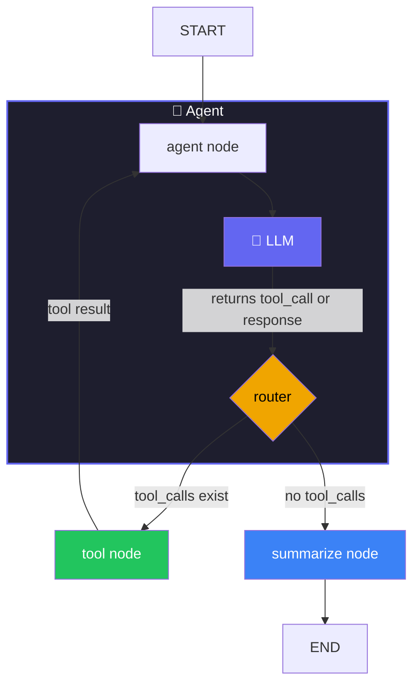

# Log Analyzer Agent - Demo

Purpose: 
Build and evaluate a LangGraph-based log analysis agent that,a short walkthrough of tasks.

## Task Coverage

1. LangGraph workflow with tool use (`main.py` + `model/model_loader.py` + `tools/log_reader.py`)
2. Small test dataset (`data/evaluation_dataset.json`, 6 examples)
3. LangSmith evaluation via UI and SDK (`evaluate.py`)
4. Realistic debug-improve loop using traces

## Architecture



- `agent`: decides what to read
- `tools`: `list_log_files`, `read_log_file`
- `summarize`: outputs structured conclusion/root cause/timestamp/fix

## Dataset

`evaluation_dataset.json` includes realistic prompts for:

- Crashes/errors
- HTTP 5xx
- Auth/security failures
- Critical issue summary
- Python tracebacks
- Traffic analytics

## Evaluation

### SDK path

```bash
cd log_analyzer
pip install -r requirements.txt
python evaluate.py
```

What happens:
1. Dataset is loaded and synced to LangSmith
2. Agent runs on each example
3. Evaluators score output (`contains`, `structure`, `min_score`)
4. Results URL is printed

### UI path

1. Open `https://smith.langchain.com`
2. Create/upload dataset from `evaluation_dataset.json`
3. Run experiment with same evaluator logic
4. Review failing traces

## Realistic Improvement Loop

1. Run baseline eval (`python evaluate.py`) - main.py(app) + evaluation.py
2. Identify weak category from scores
3. Open trace and diagnose (tool miss? weak summary? missing context?)
4. Apply one fix in code or parameters - like temperature etc
5. Re-run eval and compare results

For a Log Analyzer Agent specifically, use temperature=0.0 — you want deterministic, consistent outputs when classifying severity or identifying root causes. Higher temperature introduces randomness which hurts your eval scores.

### Temperature Recommendations

| Task | Recommended Temp |
|---|---|
| Log analysis / classification | `0.0` |
| Root cause identification | `0.0` |
| Generating recommendations | `0.1 – 0.3` |
| Creative / summarization | `0.5+` |

LLM_TEMPERATURE=0.5 python evaluate.py

Gemini Free tier for LLM as Judge:
### Gemini free tier (default)
EVAL_THROTTLE_SECONDS=15 python evaluate.py

### OpenAI / paid tier — no throttle needed
EVAL_THROTTLE_SECONDS=0 python evaluate.py

### Groq free tier (~30 RPM)
EVAL_THROTTLE_SECONDS=3 python evaluate.py

### Reference Files

- `main.py`
- `log_reader.py`
- `evaluate.py`
- `evaluation_dataset.json`
- `README.md` (detailed)
- `README_DEMO.md` (this quick script)

### Commands:
python evaluate.py --provider openai --model gpt-5-mini  --judge-provider openai --judge-model gemma2-9b-it --example 0

Models:
llama-3.3-70b-versatile

#questions:
- Evaluator
  - use evaluation experient from a successful run or set a baseline reference with another model?
  - loading your own classifier, agent of your own, regression models, custom code evaluators we can attach with SDK
  - Rate limiters are there in free models and hence have to use few cases only
  - 

- Auto evaluators
  - Its in tutorial, UI is different.

- Issues:
  - Sometimes it shows failed
  - 
