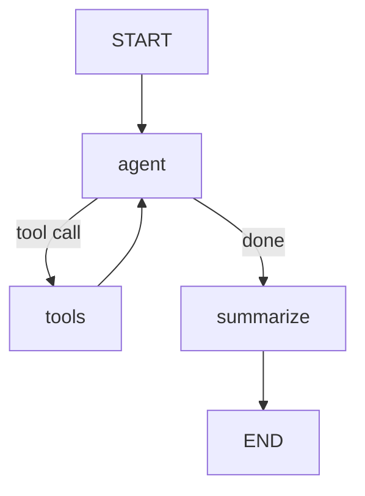

# Log Analyzer Agent - Demo

Purpose: 
Build and evaluate a LangGraph-based log analysis agent that,a short walkthrough of tasks.

## Task Coverage

1. LangGraph workflow with tool use (`main.py` + `log_reader.py`)
2. Small test dataset (`evaluation_dataset.json`, 6 examples)
3. LangSmith evaluation via UI and SDK (`evaluate.py`)
4. Realistic debug-improve loop using traces

## Architecture



- `agent`: decides what to read
- `tools`: `list_log_files`, `read_log_file`
- `summarize`: outputs structured conclusion/root cause/timestamp/fix

## Dataset

`evaluation_dataset.json` includes realistic prompts for:

- Crashes/errors
- HTTP 5xx
- Auth/security failures
- Critical issue summary
- Python tracebacks
- Traffic analytics

## Evaluation

### SDK path

```bash
cd log_analyzer
pip install -r requirements.txt
python evaluate.py
```

What happens:
1. Dataset is loaded and synced to LangSmith
2. Agent runs on each example
3. Evaluators score output (`contains`, `structure`, `min_score`)
4. Results URL is printed

### UI path

1. Open `https://smith.langchain.com`
2. Create/upload dataset from `evaluation_dataset.json`
3. Run experiment with same evaluator logic
4. Review failing traces

## Realistic Improvement Loop

1. Run baseline eval (`python evaluate.py`)
2. Identify weak category from scores
3. Open trace and diagnose (tool miss? weak summary? missing context?)
4. Apply one fix in code or parameters - like temperature etc
5. Re-run eval and compare results

## Reference Files

- `main.py`
- `log_reader.py`
- `evaluate.py`
- `evaluation_dataset.json`
- `README.md` (detailed)
- `README_DEMO.md` (this quick script)
