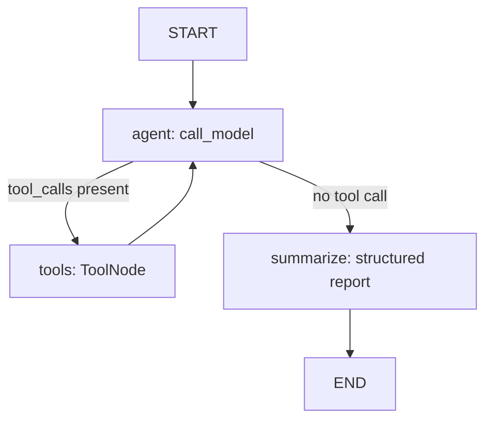
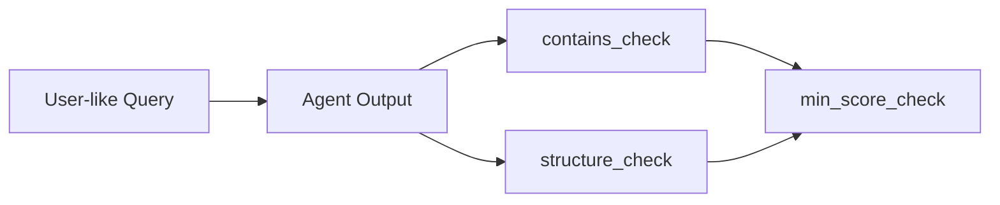
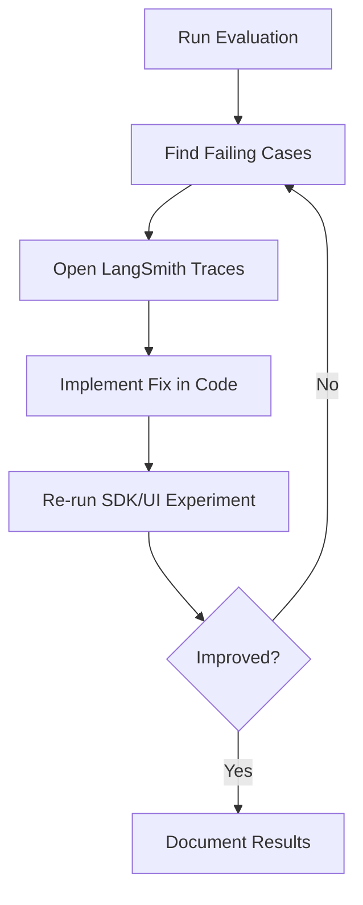

# Log Analyzer Agent (LangGraph + LangSmith Demo)

This README is structured as a **demo script** for a realistic agent-building workflow.

## Demo Goal

Build and evaluate a LangGraph-based log analysis agent that:

1. Uses tools to inspect logs and produce structured findings.
2. Is tested on a small synthetic/realistic dataset.
3. Is evaluated in LangSmith using both the UI and SDK.
4. Is iteratively improved based on failures and trace debugging.

---

## 1) LangGraph Workflow (Task 1)

The app is a simple tool-using agent graph:

- `agent` node: model decides what to do next.
- `tools` node: executes `list_log_files` and `read_log_file`.
- `summarize` node: forces a consistent markdown incident summary.
- `router`: loops to tools when tool calls are requested; otherwise summarizes.



### Key files

- `main.py`: graph definition (`agent -> tools -> agent -> summarize`).
- `log_reader.py`: tools (`list_log_files`, `read_log_file`).
- `model_loader.py` + `openai_model.py`: model/tool binding.

---

## 2) Evaluation Dataset (Task 2)

Dataset lives in `evaluation_dataset.json` (6 examples) and includes:

- Error/crash detection
- HTTP 5xx detection
- Auth/security checks
- Critical issue summary
- Traceback extraction
- Traffic pattern query

Each example has:

- `inputs.query`
- `outputs.expected_contains`
- `outputs.expected_structure`
- `outputs.min_score`
- `metadata` (difficulty/category)



---

## 3) Run LangSmith Evaluation in Two Ways (Task 3)

## A. LangSmith UI

1. Open `https://smith.langchain.com`.
2. Create dataset from `evaluation_dataset.json` (or enter examples manually).
3. Create a new experiment against your agent.
4. Attach evaluators analogous to:
   - contains check
   - structure check
   - min-score check
5. Run experiment and inspect trace-level failures.

## B. LangSmith SDK (Programmatic)

From `log_analyzer/`:

```bash
pip install -r requirements.txt
python evaluate.py
```

`evaluate.py` does the following:

1. Loads local dataset JSON.
2. Creates/uses `<project>-dataset` in LangSmith.
3. Runs `agent_predict` over each example.
4. Scores each run with 3 custom evaluators.
5. Prints aggregate scores and a LangSmith results URL.

---

## 4) Realistic Debug/Improve Loop (Task 4)

Use this as your demo narrative:

1. **Baseline run**: execute `python evaluate.py` and capture weak categories.
2. **Inspect traces** in LangSmith: confirm whether failures are from tool usage, missing context, or bad summary formatting.
3. **Make one concrete fix** (examples):
   - Improve routing logic in `main.py`
   - Adjust summary prompt structure
   - Tune `read_log_file` line window
4. **Re-run evaluation** and compare experiment scores.



---

## Quick Start

### Prerequisites

- Python 3.8+
- OpenAI API key
- LangSmith API key

### Setup

```bash
cd log_analyzer
pip install -r requirements.txt
cp .env.example .env
```

Update `.env`:

```env
OPENAI_API_KEY="your-openai-key"
OPENAI_MODEL="gpt-5-mini"
LANGSMITH_API_KEY="your-langsmith-key"
LANGSMITH_PROJECT="log-analyzer"
LOG_DIRECTORY="./logs"
```

### Run the agent

```bash
python main.py
```

### Run programmatic eval

```bash
python evaluate.py
```

---

## Suggested Demo Walkthrough (10-15 min)

1. Show architecture diagram and explain graph nodes.
2. Open `evaluation_dataset.json` and highlight realistic test prompts.
3. Run `python evaluate.py` live.
4. Open LangSmith results URL and inspect one failed trace.
5. Apply a small fix and re-run to show measurable improvement.

---

## Project Structure

```text
log_analyzer/
├── main.py
├── log_reader.py
├── model_loader.py
├── openai_model.py
├── evaluate.py
├── evaluation_dataset.json
├── EVALUATION.md
├── QUICK_START_EVAL.md
├── requirements.txt
└── README.md
```

---

## Notes

- Existing detailed guides remain in:
  - `EVALUATION.md`
  - `QUICK_START_EVAL.md`
- This README is intentionally optimized for **interview/demo storytelling**.

eval_dataset_name = f"{PROJECT_NAME}-dataset"
logs_dataset_name = f"{PROJECT_NAME}-logs"

- seperate module for langsmith and langgraph properly directory
- langgraph
- langsmith
- model module
- data directory

- Winrate - temperature 0, temp 1, ask llm judge
- Average length - response length, character length
- preference bias - avoid self preference bias by opting different llm judge
- length bias - introvert and extrovert bias
- positional bias - first found result
- thinking conf - top k, thought chains - temperature
- prompt templates
- temperature is for deterministic and undeterministic

- Evaluation Test prompt
- Evaluater prompt

- Agent prompt
- llm as a judge another model
- 
