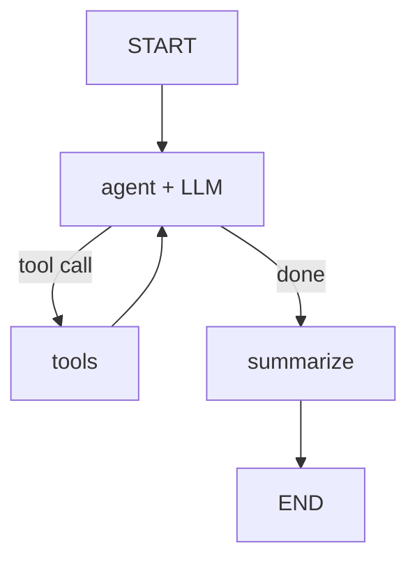
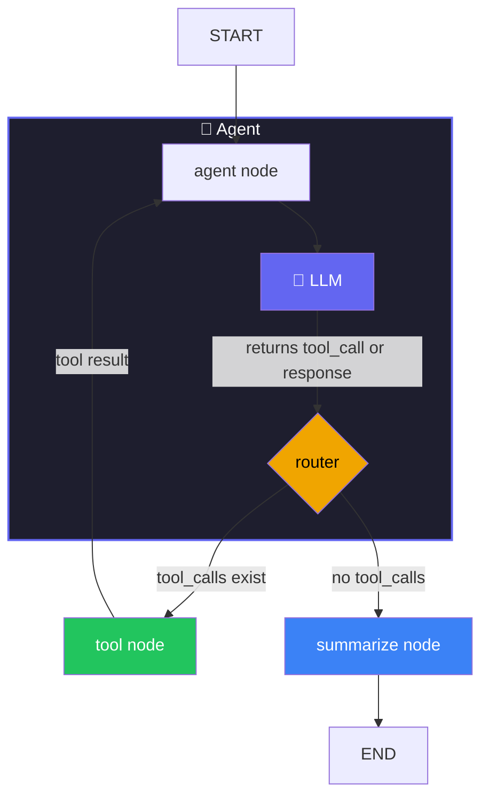

```mermaid
flowchart TD
    A[START] --> B[agent + LLM]
    B -->|tool call| C[tools]
    C --> B
    B -->|done| D[summarize]
    D --> E[END]
```

```mermaid
flowchart TD
    A[START] --> B

    subgraph AGENT["🧠 Agent"]
        B[agent node] --> LLM[🤖 LLM]
        LLM -->|returns tool_call or response| R{router}
    end

    R -->|tool_calls exist| C[tool node]
    C -->|tool result| B
    R -->|no tool_calls| D[summarize node]
    D --> E[END]

    style LLM fill:#6366f1,color:#fff
    style R fill:#f0a500,color:#000
    style C fill:#22c55e,color:#fff
    style D fill:#3b82f6,color:#fff
    style AGENT fill:#1e1e2e,color:#fff,stroke:#6366f1,stroke-width:2px
```
