### Evaluation Architecture

```mermaid
flowchart TD
    CLI(["🖥️ CLI\nevaluate.py\n--provider --model\n--judge-provider --judge-model\n--example --temperature"])
    CLI -->|overrides os.environ| LOCK

    LOCK(["🔒 Process Lock\n/tmp/log_analyzer_eval.lock\none experiment at a time"])
    LOCK --> LOOP

    subgraph LOOP["🔁 Example Loop  (sequential)"]
        direction TB
        IDX["example #N\nsorted by created_at"] --> AGENT
        subgraph AGENT["🧠 Agent  (LangGraph)"]
            SYS["SystemMessage\nno hallucination rules"] --> AM["Agent Model\nLLM_PROVIDER / MODEL_NAME"]
            AM -->|tool_calls| TOOLS["Tools\nlist_log_files · read_log_file"]
            TOOLS --> AM
            AM -->|done| SUM["Summarize\nstructured markdown"]
        end
        AGENT -->|output| EVALS
        subgraph EVALS["📊 Evaluators"]
            direction LR
            E1["contains_check"]
            E2["structure_check"]
            E3["min_score_check"]
            E4["llm_judge\nJUDGE_PROVIDER / JUDGE_MODEL\ntemp=0"]
        end
        EVALS --> EXP
        EXP(["🏷️ Experiment\n{project}-{provider}-{model}-example-{N}"])
    end

    EXP --> LS(["📡 LangSmith\nDataset + Experiment results"])
    THROTTLE(["⏱️ Throttle\nEVAL_THROTTLE_SECONDS\nbetween examples"])
    AGENT -.->|rate limit guard| THROTTLE

    style CLI fill:#475569,color:#fff
    style LOCK fill:#dc2626,color:#fff
    style LOOP fill:#1e1e2e,color:#fff,stroke:#6366f1,stroke-width:2px
    style AGENT fill:#14532d,color:#fff,stroke:#22c55e,stroke-width:1px
    style EVALS fill:#1e3a5f,color:#fff,stroke:#3b82f6,stroke-width:1px
    style EXP fill:#6366f1,color:#fff
    style LS fill:#0ea5e9,color:#fff
    style THROTTLE fill:#92400e,color:#fff
```



**CLI overrides** — all `.env` values can be overridden at runtime:

```bash
# Run example 0 with groq agent, openai judge
python evaluate.py --provider groq --model llama-3.3-70b-versatile \
                   --judge-provider openai --judge-model gpt-4o-mini \
                   --example 0

# Run all 6 examples (6 separate experiments)
python evaluate.py --provider groq --model llama-3.3-70b-versatile
```